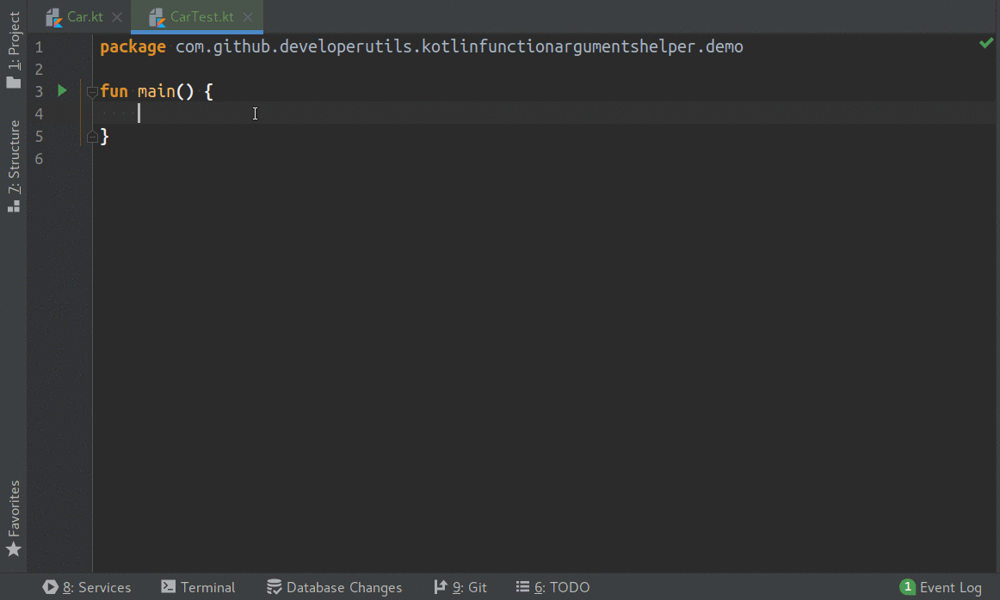

# kotlin-function-arguments-helper plugin

Intellij plugin that provide intention action for empty constructor or function to fill property with default value.

Inspired by and extended from [Kotlin Fill Class Plugin](https://github.com/suusan2go/kotlin-fill-class)

## Usage

This plugin adds an intention action for invalid constructor or function call expressions.

## How to install

0. Checkout repository `git clone https://github.com/DeveloperUtils/kotlin-function-arguments-helper.git`
   or `git clone git@github.com:DeveloperUtils/kotlin-function-arguments-helper.git`
1. Build this plugin `./gradlew build`
2. Install the plugin from `./build/distributions/kotlin-function-arguments-helper*.zip` 
   with *Install plugin from disk* in IDEA plugin manager
   
## Thanks

- [@suunsa](https://github.com/suunsan2go) For the plugin idea and development of it.
- [@t-kameyama](https://github.com/t-kameyama) Fill function call arguments [#17](https://github.com/suusan2go/kotlin-fill-class/pull/17)
- [@shiraji](https://github.com/shiraji) Convert to intention & Support non-empty constructor [#6](https://github.com/suusan2go/kotlin-fill-class/pull/6)
- [@Pluu](https://github.com/Pluu) [@naofumi-fujii](https://github.com/naofumi-fujii]) fix #2 Double type fill error [#3](https://github.com/suusan2go/kotlin-fill-class/pull/3)
